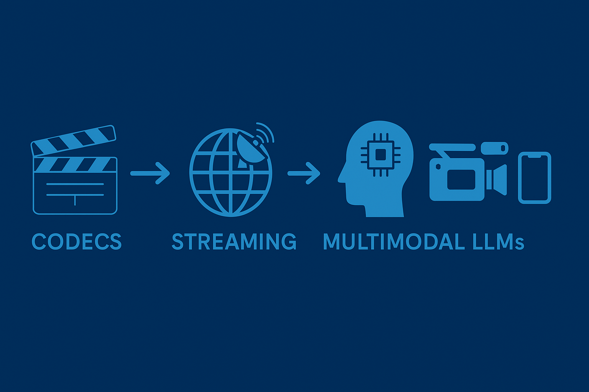

# Video-Streaming-Survey

# Awesome Next-Gen Video Streaming 🚀🎥🌐🤖

This is a repository for collecting resources about **Video Streaming** and its **next-generation evolution**.  
Unlike traditional surveys that only focus on codecs, ABR, and QoE, this repo aims to **bridge the gap** between  
classic streaming techniques and **modern AI/ML-based methods**, especially the integration with  
**Multimodal Large Models (VLMs/VLAs)** and **intelligent production devices**.

## 📌 Table of Contents
- [Introduction](#introduction)
- [Traditional Methods](#traditional-methods)
- [Machine Learning-based Methods](#machine-learning-based-methods)
- [Large Multimodal Models for Streaming](#large-multimodal-models-for-streaming)
- [Datasets and Benchmarks](#datasets-and-benchmarks)
- [Production Devices and Application Scenarios](#production-devices-and-application-scenarios)
- [Challenges and Future Directions](#challenges-and-future-directions)

## 📄 Paper List
### Survey of Streaming Video
 1. `['ACM'24]` An End-to-End Pipeline Perspective on Video Streaming in Best-Effort Networks: A Survey and Tutorial [[PDF](https://arxiv.org/pdf/2403.05192)]
 2. `['COMSNETS'24]` Quality of Experience in Video Streaming: Status Quo, Pitfalls, and Guidelines [[PDF](https://ieeexplore-ieee-org.sheffield.idm.oclc.org/stamp/stamp.jsp?tp=&arnumber=10427330)]

### Traditional Methods

### Machine Learning-based Methods
 1. `['ACM'23]` Empowerment of Atypical Viewers via Low-Effort Personalized Modeling of Video Streaming Quality [[PDF](https://dl-acm-org.sheffield.idm.oclc.org/doi/pdf/10.1145%2F3629139)]
 2. `['IEEE Trans. Multimedia'23]` RAV: Learning-Based Adaptive Streaming to Coordinate the Audio and Video Bitrate Selections [[PDF](https://ieeexplore-ieee-org.sheffield.idm.oclc.org/stamp/stamp.jsp?tp=&arnumber=9854189&tag=1)]
 3. `['IEEE Trans. Netw. Serv. Manage.'24]` MEC-Based Super-Resolution Enhanced Adaptive Video Streaming Optimization for Mobile Networks With Satellite Backhaul [[PDF](https://ieeexplore-ieee-org.sheffield.idm.oclc.org/stamp/stamp.jsp?tp=&arnumber=10473143)]
 4. `['ACM MMSys.'24]` OASIS: Collaborative Neural-Enhanced Mobile Video Streaming [[PDF](https://dl-acm-org.sheffield.idm.oclc.org/doi/pdf/10.1145/3625468.3647610)]
 5. `['IEEE IWCMC.'24]` EASR: Enabling Neural-Enhanced Video Streaming on Mobile Devices with Edge Assistance [[PDF](https://ieeexplore-ieee-org.sheffield.idm.oclc.org/stamp/stamp.jsp?tp=&arnumber=10592463&tag=1)]
 6. `['IEEE Transactions on Mobile Computing.'25]` REM: Enabling Real-Time Neural-Enhanced Video Streaming on Mobile Devices Using Macroblock-Aware Lookup Table [[PDF](https://ieeexplore-ieee-org.sheffield.idm.oclc.org/stamp/stamp.jsp?tp=&arnumber=10750425)]

### Multimodal LLMs for Streaming
1. `['CVPR'24]` VideoLLM-online: Online Large Language Model for Streaming Video [[PDF](https://openaccess.thecvf.com/content/CVPR2024/html/Chen_VideoLLM-online_Online_Video_Large_Language_Model_for_Streaming_Video_CVPR_2024_paper)], [[Code](https://showlab.github.io/videollm-online/)]
2. `['CVPR'25]` Dispider: Enabling Video LLMs with Active Real-Time Interaction via Disentangled Perception, Decision, and Reaction [[PDF](https://openaccess.thecvf.com/content/CVPR2025/papers/Qian_Dispider_Enabling_Video_LLMs_with_Active_Real-Time_Interaction_via_Disentangled_CVPR_2025_paper.pdf)], [[Code](https://github.com/Mark12Ding/Dispider)]
3. `['CVPR'25]` LiveCC: Learning Video LLM with Streaming Speech Transcription at Scale [[PDF](https://openaccess.thecvf.com/content/CVPR2025/papers/Qian_Dispider_Enabling_Video_LLMs_with_Active_Real-Time_Interaction_via_Disentangled_CVPR_2025_paper.pdf)], [[Code](https://showlab.github.io/livecc/)]
4. `['arXiv'25]` TimeChat-Online: 80% Visual Tokens are Naturally Redundant in Streaming Videos [[PDF](https://arxiv.org/pdf/2504.17343)], [[Code](https://github.com/yaolinli/TimeChat-Online)]
5. `['CVPR'25]` TimeChat-Online: 80% Visual Tokens are Naturally Redundant in Streaming Videos [[PDF](https://openaccess.thecvf.com/content/CVPR2025/papers/Wang_OmniMMI_A_Comprehensive_Multi-modal_Interaction_Benchmark_in_Streaming_Video_Contexts_CVPR_2025_paper.pdf)], [[Code](https://omnimmi.github.io/)]
6. `['arXiv'25]` VideoLLaMB: Long Streaming Video Understanding with Recurrent Memory Bridges [[PDF](https://arxiv.org/pdf/2409.01071)], [[Code](https://github.com/bigai-nlco/VideoLLaMB)]
7. `['EMNLP'24]` Efficient Temporal Extrapolation of Multimodal Large Language Models with Temporal Grounding Bridge [[PDF](https://aclanthology.org/2024.emnlp-main.556.pdf)], [[Code](https://github.com/bigai-nlco/VideoTGB)]

### Production Devices and Application Scenarios

### Challenges and Future Directions

## 🗓️ Timeline
- 2025-09-01: Repo initialized
- 2025-09-05: First batch of papers added

## 🔥 TODO
- [ ] Add 2024–2025 survey papers
- [ ] Build timeline figure
- [ ] Add datasets section
